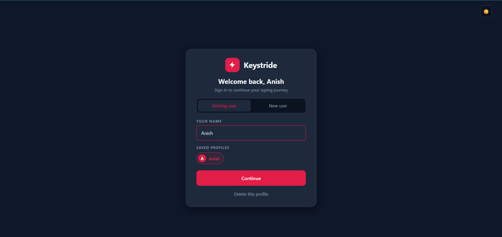
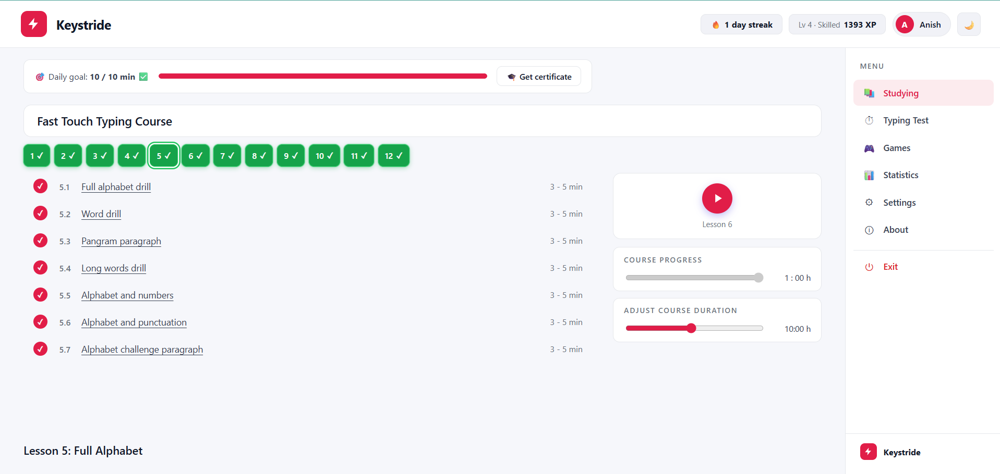
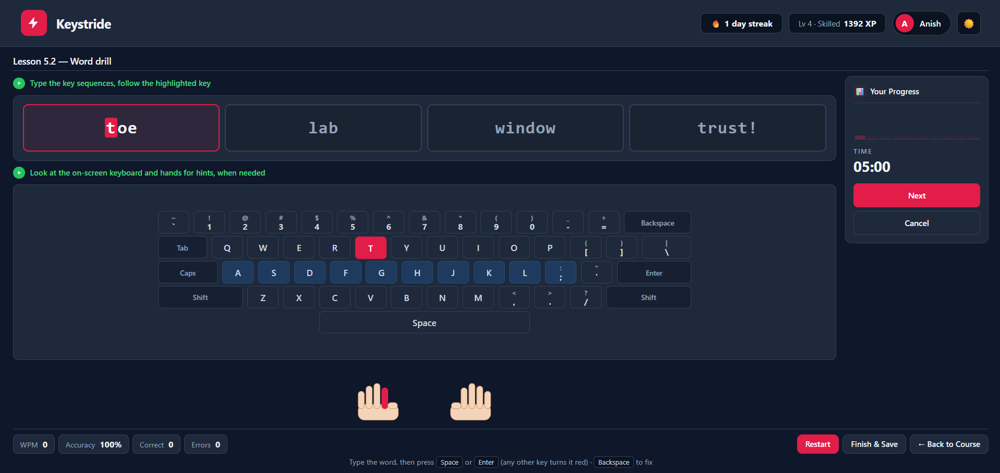
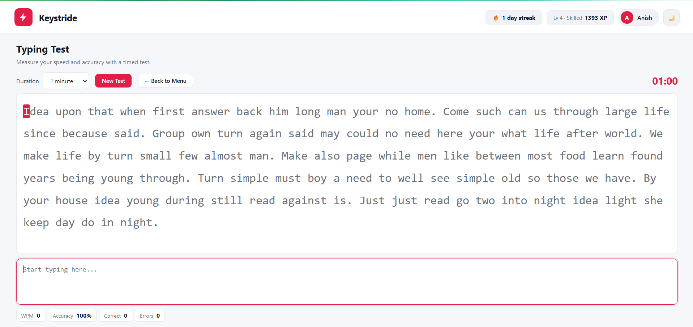
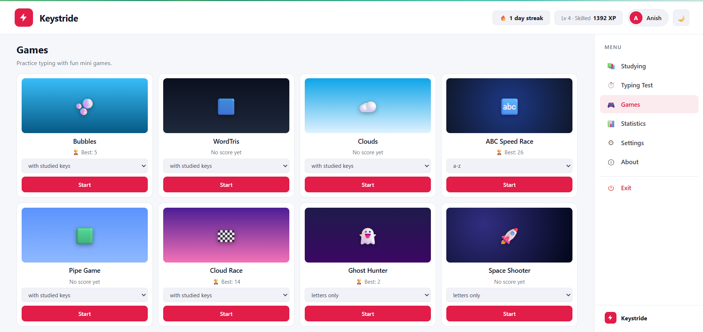
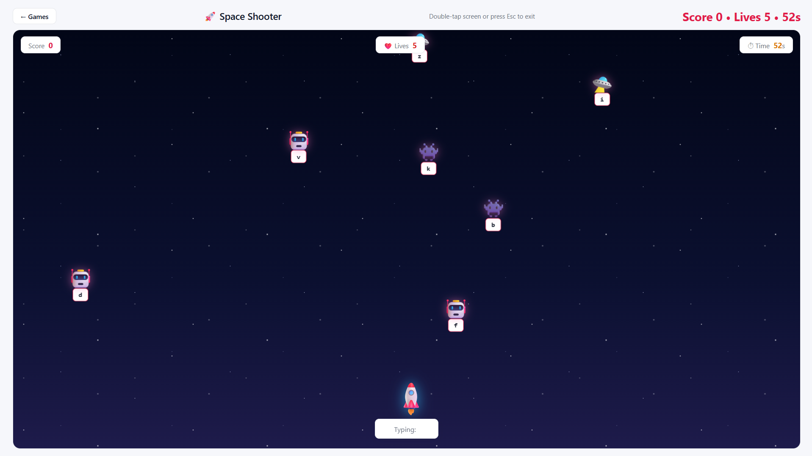
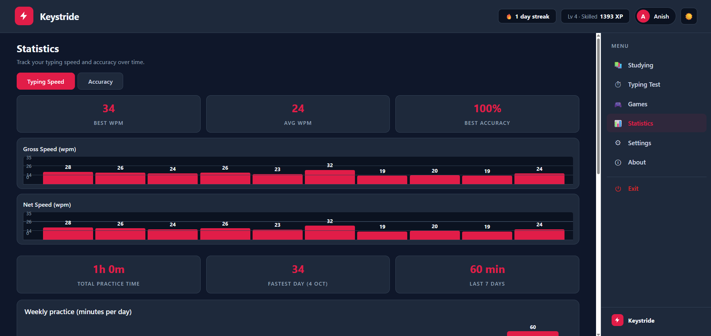
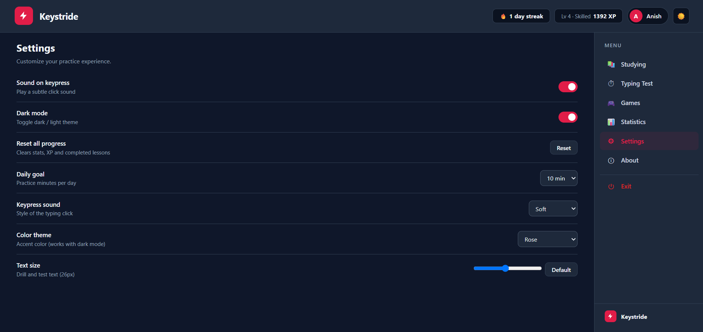
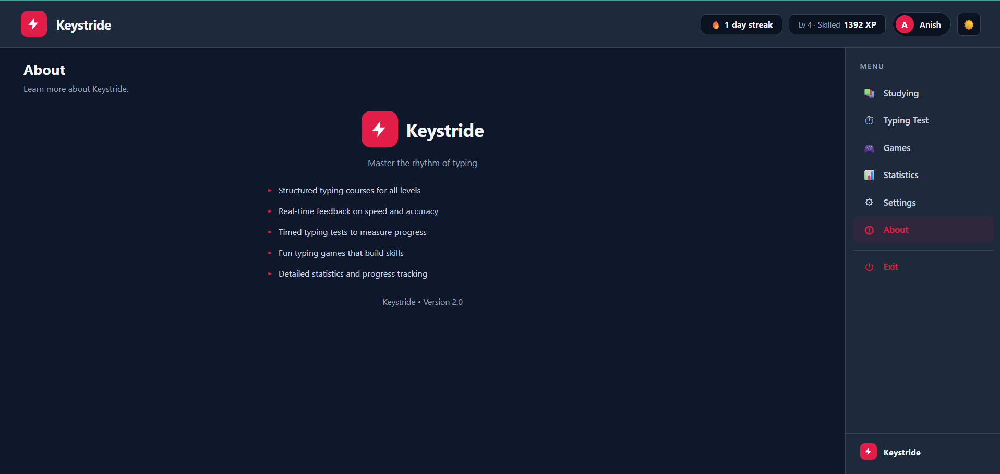

# ⌨️ Keystride — Typing Master

<p align="center">
  <strong>Build Speed • Improve Accuracy • Master the Keyboard</strong>
</p>

<p align="center">
  A modern and interactive typing practice web application designed to help users improve their typing speed, accuracy, consistency, and keyboard skills.
</p>

<p align="center">
  
  
  
  
</p>

<p align="center">
  <a href="#-features">Features</a> •
  <a href="#-screenshots">Screenshots</a> •
  <a href="#-tech-stack">Tech Stack</a> •
  <a href="#-installation">Installation</a> •
  <a href="#-future-improvements">Future Improvements</a>
</p>

---

## 📌 About The Project

**Keystride — Typing Master** is a frontend-based typing practice platform created to make typing improvement more structured, measurable, and engaging.

The application provides users with a complete typing-learning experience that includes **guided lessons, typing drills, timed tests, games, performance statistics, settings, and certificate generation**.

Instead of relying on repetitive typing exercises, Keystride combines practice with interactive challenges and progress tracking to encourage consistent improvement.

### 🎯 Project Goal

> **Practice consistently. Type accurately. Get faster.**

The primary objective is to help users develop:

* ⌨️ Better keyboard familiarity
* ⚡ Higher typing speed
* 🎯 Improved accuracy
* 🧠 Stronger muscle memory
* 📈 Consistent typing performance

---

# ✨ Features

<table>
<tr>
<td width="50%">

### 👤 User Profile

* Personalized profile
* User progress
* Individual learning experience
* Profile-based interaction

</td>
<td width="50%">

### 📚 Typing Course

* Structured lessons
* Progressive learning
* Guided exercises
* Keyboard skill development

</td>
</tr>

<tr>
<td>

### 🎯 Guided Drills

* Focused typing exercises
* Real-time practice
* Accuracy-oriented training
* Muscle memory development

</td>
<td>

### ⏱️ Typing Tests

* Timed typing challenges
* WPM calculation
* Accuracy calculation
* Performance results

</td>
</tr>

<tr>
<td>

### 🎮 Typing Games

* Interactive game modes
* Challenge-based practice
* Space Shooter mode
* Fast keyboard response training

</td>
<td>

### 📊 Statistics

* Typing speed tracking
* Accuracy tracking
* Progress monitoring
* Performance history

</td>
</tr>

<tr>
<td>

### ⚙️ Settings

* Application preferences
* User customization
* Learning experience controls

</td>
<td>

### 🏆 Certificate

* Completion-based certificate
* Achievement recognition
* Learning milestone

</td>
</tr>
</table>

---

# 🖥️ Screenshots

> A visual overview of the Keystride Typing Master interface and major features.

---

## 01 · 👋 Welcome & Profile

<p align="center">
  
</p>

---

## 02 · 📚 Course Dashboard

<p align="center">
  
</p>

---

## 03 · 🎯 Guided Drill

<p align="center">
  
</p>

---

## 04 · ⌨️ Typing Test

<p align="center">
  
</p>

---

## 05 · 🎮 Games

<p align="center">
  
</p>

---

## 06 · 🚀 Space Shooter

<p align="center">
  
</p>

---

## 07 · 📊 Statistics

<p align="center">
  
</p>

---

## 08 · ⚙️ Settings

<p align="center">
  
</p>

---

## 09 · ℹ️ About

<p align="center">
  
</p>

---

## 10 · 🏆 Certificate

<p align="center">
  
</p>

---

# 🛠️ Tech Stack

| Technology          | Usage                                              |
| ------------------- | -------------------------------------------------- |
| 🧱 **HTML5**        | Application structure and semantic markup          |
| 🎨 **CSS3**         | Styling, layouts, animations and responsive design |
| ⚡ **JavaScript**    | Application logic and interactive functionality    |
| 💾 **LocalStorage** | Client-side progress and user data persistence     |
| 🔤 **Google Fonts** | Typography and visual presentation                 |

---

# 🧠 Core Concepts Implemented

This project demonstrates practical frontend development concepts such as:

```text
├── DOM Manipulation
├── Event Handling
├── Keyboard Event Detection
├── Real-Time User Interaction
├── Timer Implementation
├── WPM Calculation
├── Accuracy Calculation
├── Progress Tracking
├── LocalStorage
├── Responsive Web Design
├── Interactive UI Development
├── Game Logic
└── Client-Side Application Architecture
```

---

# 📂 Project Structure

```text
Typing-Master-Pro/
│
├── 📄 index.html
├── 📄 README.md
│
└── 📁 screenshots/
    │
    ├── 🖼️ 01-welcome-profile.png
    ├── 🖼️ 02-course-dashboard.png
    ├── 🖼️ 03-guided-drill.png
    ├── 🖼️ 04-typing-test.png
    ├── 🖼️ 05-games.png
    ├── 🖼️ 06-space-shooter.png
    ├── 🖼️ 07-statistics.png
    ├── 🖼️ 08-settings.png
    ├── 🖼️ 09-about.png
    └── 🖼️ 10-certificate.png
```

---

# 🚀 Installation & Setup

## 1️⃣ Clone the Repository

```bash
git clone https://github.com/saurav-kumar-tech/Typing-Master-Pro.git
```

## 2️⃣ Navigate to the Project

```bash
cd Typing-Master-Pro
```

## 3️⃣ Run the Application

Open:

```text
index.html
```

directly in your browser.

### ⭐ Recommended

For development, open the project in **VS Code** and use the **Live Server** extension.

---

# 💻 Requirements

No backend server or database installation is required.

### You only need:

* 🌐 Modern web browser
* 💻 VS Code
* 🚀 Live Server extension *(optional)*

---

# 🎯 Learning Experience

Keystride follows a progressive approach to typing improvement:

```text
Learn
  ↓
Practice
  ↓
Improve Accuracy
  ↓
Increase Speed
  ↓
Take Tests
  ↓
Play Challenges
  ↓
Track Progress
  ↓
Achieve Milestones
```

---

# 📊 Performance Tracking

The application focuses on two important typing metrics:

### ⚡ Words Per Minute — WPM

Measures how quickly the user can type during a typing session.

### 🎯 Accuracy

Measures the percentage of correctly typed characters or words during practice.

Together, these metrics help users understand their typing performance and monitor improvement over time.

---

# 🎮 Gamified Learning

Keystride introduces game-based typing practice to make learning more engaging.

### 🚀 Space Shooter

The Space Shooter mode combines:

* Keyboard typing
* Fast response
* Timing
* Accuracy
* Game interaction

This allows users to practice typing while participating in an interactive challenge.

---

# 🔐 Privacy

Keystride is designed as a client-side web application.

Where applicable, user-related information and progress are handled through browser-based storage rather than requiring a dedicated backend server.

No account creation or server configuration is required to start using the application.

---

# 🧪 Testing Checklist

| Feature              | Status |
| -------------------- | :----: |
| User Profile         |    ✅   |
| Course Navigation    |    ✅   |
| Guided Typing Drill  |    ✅   |
| Typing Test          |    ✅   |
| WPM Calculation      |    ✅   |
| Accuracy Tracking    |    ✅   |
| Typing Games         |    ✅   |
| Space Shooter        |    ✅   |
| Statistics           |    ✅   |
| Settings             |    ✅   |
| Certificate          |    ✅   |
| Responsive Interface |    ✅   |

---

# 📈 Future Improvements

The project can be extended with:

* [ ] ☁️ Cloud-based progress synchronization
* [ ] 👥 Online user accounts
* [ ] 🏆 Global typing leaderboard
* [ ] 🌐 Multiplayer typing competitions
* [ ] 🎮 Additional typing games
* [ ] 📊 Advanced performance analytics
* [ ] 📅 Daily typing challenges
* [ ] ✍️ Custom typing passages
* [ ] 🌙 Advanced Dark/Light themes
* [ ] 📱 Improved mobile experience
* [ ] 🔐 Backend authentication
* [ ] 🗄️ Database integration
* [ ] 📄 Exportable performance reports

---

# 🌟 Why Keystride?

Typing is an essential digital skill for:

* 👨‍💻 Developers
* 🎓 Students
* 🧑‍💼 Office Professionals
* ✍️ Writers
* 📊 Data Entry Professionals
* 💻 Computer Users

Keystride transforms traditional typing practice into a **structured, interactive, and measurable learning experience**.

---

# 👨‍💻 About The Developer

## Saurav Kumar

**BCA Student | Aspiring Software Developer | Java & Web Development Enthusiast**

I enjoy building practical software projects and continuously developing my skills in:

`Java` • `Python` • `Web Development` • `AI` • `Software Development`

### 🌐 Connect With Me

<p>
  <a href="https://github.com/saurav-kumar-tech">
    
  </a>
  <a href="https://www.linkedin.com/in/saurav-kumar-it/">
    
  </a>
</p>

---

# ⭐ Support The Project

If you found **Keystride — Typing Master** useful or interesting:

⭐ **Star the repository**

🍴 **Fork the project**

💡 **Share your feedback**

---

# 📌 Project Information

| Category             | Details                   |
| -------------------- | ------------------------- |
| **Project Name**     | Keystride — Typing Master |
| **Project Type**     | Frontend Web Application  |
| **Status**           | ✅ Completed               |
| **Primary Language** | JavaScript                |
| **Markup**           | HTML5                     |
| **Styling**          | CSS3                      |
| **Storage**          | Browser LocalStorage      |
| **Developer**        | Saurav Kumar              |

---

<p align="center">

### ⌨️ Keystride — Typing Master

<strong>Build Speed • Improve Accuracy • Master the Keyboard</strong>

<br><br>

Made with ❤️ by <strong>Saurav Kumar</strong>

</p>
